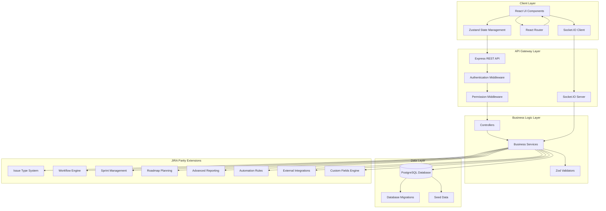
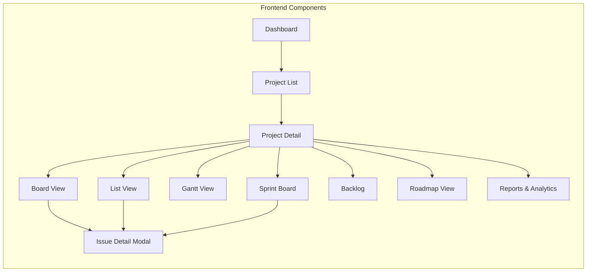
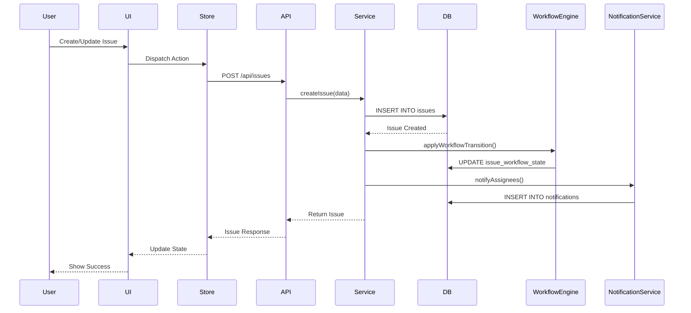

# Design Document: JIRA Parity Development

## Overview

This design document outlines the comprehensive development plan to achieve 99% functional and UI/UX parity with JIRA Atlassian for the existing Project Management application. The current application is a Microsoft Planner-style task board with automatic Gantt chart generation, built on React + Vite frontend and Express + PostgreSQL backend.

The goal is to transform the current application into a JIRA-equivalent system by conducting deep learning of the existing codebase, performing gap analysis against JIRA's feature set, and creating a detailed technical roadmap for implementation. This includes enhancing issue tracking, workflows, boards, sprints, roadmaps, reports, automation, and advanced project management capabilities.

**Current Application Stack:**
- **Frontend**: React 18, Vite, React Router, Tailwind CSS, Axios, dnd-kit, date-fns, Zustand, Socket.IO Client, Lucide React
- **Backend**: Node.js, Express, PostgreSQL (pg), bcryptjs, CORS, Socket.IO, Zod
- **Database**: PostgreSQL with comprehensive schema for projects, tasks, buckets, users, departments, locations, comments, labels, checklists, notifications, chat, activity logs

**Current Application Features:**
- Dashboard with project/task/progress/overdue monitoring
- Project management with members and roles
- Board View with drag-and-drop (grouping by Status or Bucket)
- Task List View with unlimited nested subtasks
- Task management (parent-child relationships, PIC, lead, dates, progress, status, priority)
- Automatic progress calculation for parent tasks
- Gantt Chart (per project, all tasks, department-level)
- Working calendar with exceptions (holidays, working days)
- Real-time chat (project, department, private, company rooms)
- Comments with mentions
- Labels and checklists
- Notifications system
- Activity logging
- RBAC (Role-Based Access Control)

## Architecture

### High-Level System Architecture



### Component Architecture



### Data Flow Architecture



## Components and Interfaces

### 1. Issue Type System

**Purpose**: Extend the current task system to support multiple issue types (Epic, Story, Task, Bug, Subtask) similar to JIRA.

**Interface**:
```typescript
interface IssueType {
  id: number;
  name: string; // 'Epic', 'Story', 'Task', 'Bug', 'Subtask'
  icon: string;
  color: string;
  hierarchy_level: number; // 0=Epic, 1=Story, 2=Task/Bug, 3=Subtask
  allowed_parent_types: string[];
  allowed_child_types: string[];
  default_workflow_id: number;
  is_system: boolean;
  project_id: number | null; // null for global types
  created_at: Date;
  updated_at: Date;
}


interface Issue extends Task {
  issue_type_id: number;
  issue_key: string; // e.g., 'PROJ-123'
  story_points: number | null;
  epic_id: number | null;
  sprint_id: number | null;
  workflow_state_id: number;
  resolution: string | null;
  environment: string | null;
  affects_versions: string[];
  fix_versions: string[];
  components: string[];
  custom_fields: Record<string, any>;
}

interface IssueTypeService {
  getIssueTypes(projectId: number): Promise<IssueType[]>;
  createIssueType(data: Partial<IssueType>): Promise<IssueType>;
  updateIssueType(id: number, data: Partial<IssueType>): Promise<IssueType>;
  deleteIssueType(id: number): Promise<void>;
  validateHierarchy(parentType: string, childType: string): boolean;
}
```

**Responsibilities**:
- Define and manage issue type configurations
- Enforce hierarchy rules (Epic > Story > Task/Bug > Subtask)
- Provide issue type metadata for UI rendering
- Support custom issue types per project
- Validate parent-child relationships based on type

### 2. Workflow Engine

**Purpose**: Implement flexible workflow system with customizable states and transitions.

**Interface**:
```typescript
interface Workflow {
  id: number;
  name: string;
  description: string;
  project_id: number | null; // null for global workflows
  is_default: boolean;
  created_at: Date;
  updated_at: Date;
}

interface WorkflowState {
  id: number;
  workflow_id: number;
  name: string;
  category: 'TODO' | 'IN_PROGRESS' | 'DONE';
  color: string;
  sort_order: number;
  is_initial: boolean;
  is_final: boolean;
}


interface WorkflowTransition {
  id: number;
  workflow_id: number;
  name: string;
  from_state_id: number;
  to_state_id: number;
  conditions: WorkflowCondition[];
  validators: WorkflowValidator[];
  post_functions: WorkflowPostFunction[];
  screen_id: number | null;
  sort_order: number;
}

interface WorkflowCondition {
  type: 'permission' | 'field_value' | 'user_role' | 'custom';
  config: Record<string, any>;
}

interface WorkflowValidator {
  type: 'required_fields' | 'field_format' | 'custom';
  config: Record<string, any>;
}

interface WorkflowPostFunction {
  type: 'update_field' | 'send_notification' | 'create_issue' | 'custom';
  config: Record<string, any>;
}

interface WorkflowService {
  getWorkflows(projectId: number): Promise<Workflow[]>;
  getWorkflowStates(workflowId: number): Promise<WorkflowState[]>;
  getWorkflowTransitions(workflowId: number): Promise<WorkflowTransition[]>;
  createWorkflow(data: Partial<Workflow>): Promise<Workflow>;
  updateWorkflow(id: number, data: Partial<Workflow>): Promise<Workflow>;
  deleteWorkflow(id: number): Promise<void>;
  transitionIssue(issueId: number, transitionId: number, context: TransitionContext): Promise<Issue>;
  validateTransition(issueId: number, transitionId: number): Promise<ValidationResult>;
}
```

**Responsibilities**:
- Manage workflow definitions and states
- Define and enforce transition rules
- Execute pre-conditions and validators before transitions
- Execute post-functions after successful transitions
- Support custom workflow logic per project
- Provide workflow visualization data

### 3. Sprint Management

**Purpose**: Implement Agile sprint planning and execution capabilities.

**Interface**:
```typescript
interface Sprint {
  id: number;
  project_id: number;
  name: string;
  goal: string;
  start_date: Date;
  end_date: Date;
  state: 'FUTURE' | 'ACTIVE' | 'CLOSED';
  completed_at: Date | null;
  created_at: Date;
  updated_at: Date;
}


interface SprintMetrics {
  sprint_id: number;
  total_issues: number;
  completed_issues: number;
  total_story_points: number;
  completed_story_points: number;
  velocity: number;
  burndown_data: BurndownPoint[];
}

interface BurndownPoint {
  date: Date;
  remaining_story_points: number;
  ideal_remaining: number;
}

interface SprintService {
  getSprints(projectId: number, state?: string): Promise<Sprint[]>;
  getActiveSprint(projectId: number): Promise<Sprint | null>;
  createSprint(data: Partial<Sprint>): Promise<Sprint>;
  updateSprint(id: number, data: Partial<Sprint>): Promise<Sprint>;
  startSprint(id: number): Promise<Sprint>;
  completeSprint(id: number, moveIncompleteIssuesTo?: number): Promise<Sprint>;
  addIssuesToSprint(sprintId: number, issueIds: number[]): Promise<void>;
  removeIssuesFromSprint(sprintId: number, issueIds: number[]): Promise<void>;
  getSprintMetrics(sprintId: number): Promise<SprintMetrics>;
  getBurndownChart(sprintId: number): Promise<BurndownPoint[]>;
}
```

**Responsibilities**:
- Create and manage sprint lifecycle (future, active, closed)
- Assign issues to sprints
- Track sprint progress and metrics
- Generate burndown charts
- Calculate velocity
- Handle sprint completion and issue rollover

### 4. Roadmap Planning

**Purpose**: Provide strategic planning and timeline visualization for epics and releases.

**Interface**:
```typescript
interface Roadmap {
  id: number;
  project_id: number;
  name: string;
  description: string;
  start_date: Date;
  end_date: Date;
  is_default: boolean;
  created_at: Date;
  updated_at: Date;
}

interface Release {
  id: number;
  project_id: number;
  name: string;
  description: string;
  start_date: Date;
  release_date: Date;
  released: boolean;
  released_at: Date | null;
  created_at: Date;
  updated_at: Date;
}


interface Epic {
  id: number;
  issue_id: number; // References issues table
  epic_name: string;
  epic_color: string;
  roadmap_id: number | null;
  release_id: number | null;
  start_date: Date | null;
  target_end_date: Date | null;
}

interface RoadmapService {
  getRoadmaps(projectId: number): Promise<Roadmap[]>;
  createRoadmap(data: Partial<Roadmap>): Promise<Roadmap>;
  updateRoadmap(id: number, data: Partial<Roadmap>): Promise<Roadmap>;
  deleteRoadmap(id: number): Promise<void>;
  getRoadmapEpics(roadmapId: number): Promise<Epic[]>;
  getReleases(projectId: number): Promise<Release[]>;
  createRelease(data: Partial<Release>): Promise<Release>;
  updateRelease(id: number, data: Partial<Release>): Promise<Release>;
  releaseVersion(id: number): Promise<Release>;
}
```

**Responsibilities**:
- Manage roadmap definitions and timelines
- Track epic progress across roadmaps
- Manage release versions
- Visualize epic timelines
- Link epics to releases
- Generate roadmap reports

### 5. Advanced Reporting & Analytics

**Purpose**: Provide comprehensive reporting and analytics capabilities.

**Interface**:
```typescript
interface Report {
  id: number;
  project_id: number | null;
  name: string;
  type: 'burndown' | 'velocity' | 'cumulative_flow' | 'control_chart' | 'custom';
  config: ReportConfig;
  is_favorite: boolean;
  created_by: number;
  created_at: Date;
  updated_at: Date;
}

interface ReportConfig {
  filters: ReportFilter[];
  groupBy: string[];
  metrics: string[];
  chartType: 'line' | 'bar' | 'pie' | 'table';
  dateRange: DateRange;
}

interface ReportFilter {
  field: string;
  operator: 'equals' | 'not_equals' | 'in' | 'not_in' | 'greater_than' | 'less_than';
  value: any;
}


interface VelocityReport {
  sprints: SprintVelocity[];
  average_velocity: number;
  trend: 'increasing' | 'decreasing' | 'stable';
}

interface SprintVelocity {
  sprint_name: string;
  completed_story_points: number;
  committed_story_points: number;
}

interface CumulativeFlowData {
  dates: Date[];
  states: {
    state_name: string;
    counts: number[];
  }[];
}

interface ReportService {
  getReports(projectId: number): Promise<Report[]>;
  createReport(data: Partial<Report>): Promise<Report>;
  updateReport(id: number, data: Partial<Report>): Promise<Report>;
  deleteReport(id: number): Promise<void>;
  generateReport(reportId: number): Promise<any>;
  getVelocityReport(projectId: number, sprintCount: number): Promise<VelocityReport>;
  getCumulativeFlowDiagram(projectId: number, dateRange: DateRange): Promise<CumulativeFlowData>;
  getControlChart(projectId: number, dateRange: DateRange): Promise<any>;
}
```

**Responsibilities**:
- Generate standard Agile reports (burndown, velocity, cumulative flow)
- Support custom report creation
- Provide data visualization configurations
- Export reports in multiple formats
- Schedule automated report generation
- Track report favorites per user

### 6. Automation Engine

**Purpose**: Implement rule-based automation for repetitive tasks and workflows.

**Interface**:
```typescript
interface AutomationRule {
  id: number;
  project_id: number | null;
  name: string;
  description: string;
  trigger: AutomationTrigger;
  conditions: AutomationCondition[];
  actions: AutomationAction[];
  is_enabled: boolean;
  execution_count: number;
  last_executed_at: Date | null;
  created_by: number;
  created_at: Date;
  updated_at: Date;
}

interface AutomationTrigger {
  type: 'issue_created' | 'issue_updated' | 'issue_transitioned' | 'comment_added' | 'scheduled';
  config: Record<string, any>;
}


interface AutomationCondition {
  type: 'field_value' | 'user_role' | 'issue_type' | 'custom_jql';
  operator: 'equals' | 'not_equals' | 'contains' | 'greater_than' | 'less_than';
  value: any;
}

interface AutomationAction {
  type: 'update_field' | 'transition_issue' | 'send_notification' | 'create_issue' | 'add_comment' | 'assign_user';
  config: Record<string, any>;
}

interface AutomationService {
  getAutomationRules(projectId: number): Promise<AutomationRule[]>;
  createAutomationRule(data: Partial<AutomationRule>): Promise<AutomationRule>;
  updateAutomationRule(id: number, data: Partial<AutomationRule>): Promise<AutomationRule>;
  deleteAutomationRule(id: number): Promise<void>;
  enableAutomationRule(id: number): Promise<AutomationRule>;
  disableAutomationRule(id: number): Promise<AutomationRule>;
  executeAutomationRule(ruleId: number, context: any): Promise<void>;
  getAutomationLogs(ruleId: number, limit: number): Promise<AutomationLog[]>;
}
```

**Responsibilities**:
- Define automation rules with triggers, conditions, and actions
- Execute automation rules based on events
- Log automation execution history
- Support scheduled automation
- Validate automation rule configurations
- Provide automation templates

### 7. Custom Fields Engine

**Purpose**: Allow users to define custom fields for issues beyond standard fields.

**Interface**:
```typescript
interface CustomField {
  id: number;
  project_id: number | null;
  name: string;
  description: string;
  field_type: 'text' | 'number' | 'date' | 'select' | 'multi_select' | 'user' | 'checkbox' | 'url';
  options: CustomFieldOption[];
  is_required: boolean;
  default_value: any;
  applicable_issue_types: string[];
  sort_order: number;
  created_at: Date;
  updated_at: Date;
}

interface CustomFieldOption {
  id: number;
  custom_field_id: number;
  value: string;
  sort_order: number;
}


interface CustomFieldValue {
  id: number;
  issue_id: number;
  custom_field_id: number;
  value: any;
  created_at: Date;
  updated_at: Date;
}

interface CustomFieldService {
  getCustomFields(projectId: number): Promise<CustomField[]>;
  createCustomField(data: Partial<CustomField>): Promise<CustomField>;
  updateCustomField(id: number, data: Partial<CustomField>): Promise<CustomField>;
  deleteCustomField(id: number): Promise<void>;
  getCustomFieldValues(issueId: number): Promise<CustomFieldValue[]>;
  setCustomFieldValue(issueId: number, fieldId: number, value: any): Promise<CustomFieldValue>;
  validateCustomFieldValue(fieldId: number, value: any): Promise<ValidationResult>;
}
```

**Responsibilities**:
- Define custom field schemas
- Validate custom field values
- Store and retrieve custom field data
- Support multiple field types
- Manage field options for select fields
- Apply custom fields to specific issue types

### 8. JQL (JIRA Query Language) Engine

**Purpose**: Implement powerful query language for advanced issue searching and filtering.

**Interface**:
```typescript
interface JQLQuery {
  query: string;
  orderBy?: string;
  limit?: number;
  offset?: number;
}

interface JQLResult {
  issues: Issue[];
  total: number;
  query: string;
  execution_time_ms: number;
}

interface JQLService {
  executeQuery(query: JQLQuery): Promise<JQLResult>;
  validateQuery(query: string): Promise<ValidationResult>;
  getSavedFilters(userId: number): Promise<SavedFilter[]>;
  createSavedFilter(data: Partial<SavedFilter>): Promise<SavedFilter>;
  updateSavedFilter(id: number, data: Partial<SavedFilter>): Promise<SavedFilter>;
  deleteSavedFilter(id: number): Promise<void>;
}

interface SavedFilter {
  id: number;
  user_id: number;
  name: string;
  description: string;
  jql_query: string;
  is_favorite: boolean;
  is_shared: boolean;
  created_at: Date;
  updated_at: Date;
}
```

**Responsibilities**:
- Parse and execute JQL queries
- Validate JQL syntax
- Support complex filtering and sorting
- Manage saved filters
- Provide query suggestions and autocomplete
- Optimize query performance

## Data Models

### Extended Database Schema

#### Issue Types Table
```typescript
CREATE TABLE issue_types (
  id SERIAL PRIMARY KEY,
  name VARCHAR(100) NOT NULL,
  icon VARCHAR(50),
  color VARCHAR(30),
  hierarchy_level INTEGER NOT NULL,
  allowed_parent_types TEXT[],
  allowed_child_types TEXT[],
  default_workflow_id INTEGER REFERENCES workflows(id),
  is_system BOOLEAN DEFAULT FALSE,
  project_id INTEGER REFERENCES projects(id) ON DELETE CASCADE,
  created_at TIMESTAMP DEFAULT CURRENT_TIMESTAMP,
  updated_at TIMESTAMP DEFAULT CURRENT_TIMESTAMP
);
```


#### Workflows Table
```typescript
CREATE TABLE workflows (
  id SERIAL PRIMARY KEY,
  name VARCHAR(150) NOT NULL,
  description TEXT,
  project_id INTEGER REFERENCES projects(id) ON DELETE CASCADE,
  is_default BOOLEAN DEFAULT FALSE,
  created_at TIMESTAMP DEFAULT CURRENT_TIMESTAMP,
  updated_at TIMESTAMP DEFAULT CURRENT_TIMESTAMP
);

CREATE TABLE workflow_states (
  id SERIAL PRIMARY KEY,
  workflow_id INTEGER NOT NULL REFERENCES workflows(id) ON DELETE CASCADE,
  name VARCHAR(100) NOT NULL,
  category VARCHAR(30) NOT NULL CHECK (category IN ('TODO', 'IN_PROGRESS', 'DONE')),
  color VARCHAR(30),
  sort_order INTEGER DEFAULT 0,
  is_initial BOOLEAN DEFAULT FALSE,
  is_final BOOLEAN DEFAULT FALSE,
  created_at TIMESTAMP DEFAULT CURRENT_TIMESTAMP,
  updated_at TIMESTAMP DEFAULT CURRENT_TIMESTAMP
);

CREATE TABLE workflow_transitions (
  id SERIAL PRIMARY KEY,
  workflow_id INTEGER NOT NULL REFERENCES workflows(id) ON DELETE CASCADE,
  name VARCHAR(150) NOT NULL,
  from_state_id INTEGER NOT NULL REFERENCES workflow_states(id) ON DELETE CASCADE,
  to_state_id INTEGER NOT NULL REFERENCES workflow_states(id) ON DELETE CASCADE,
  conditions JSONB DEFAULT '[]'::JSONB,
  validators JSONB DEFAULT '[]'::JSONB,
  post_functions JSONB DEFAULT '[]'::JSONB,
  screen_id INTEGER,
  sort_order INTEGER DEFAULT 0,
  created_at TIMESTAMP DEFAULT CURRENT_TIMESTAMP,
  updated_at TIMESTAMP DEFAULT CURRENT_TIMESTAMP
);
```

#### Sprints Table
```typescript
CREATE TABLE sprints (
  id SERIAL PRIMARY KEY,
  project_id INTEGER NOT NULL REFERENCES projects(id) ON DELETE CASCADE,
  name VARCHAR(150) NOT NULL,
  goal TEXT,
  start_date DATE,
  end_date DATE,
  state VARCHAR(30) DEFAULT 'FUTURE' CHECK (state IN ('FUTURE', 'ACTIVE', 'CLOSED')),
  completed_at TIMESTAMP,
  created_at TIMESTAMP DEFAULT CURRENT_TIMESTAMP,
  updated_at TIMESTAMP DEFAULT CURRENT_TIMESTAMP
);
```

#### Roadmaps and Releases Tables
```typescript
CREATE TABLE roadmaps (
  id SERIAL PRIMARY KEY,
  project_id INTEGER NOT NULL REFERENCES projects(id) ON DELETE CASCADE,
  name VARCHAR(150) NOT NULL,
  description TEXT,
  start_date DATE,
  end_date DATE,
  is_default BOOLEAN DEFAULT FALSE,
  created_at TIMESTAMP DEFAULT CURRENT_TIMESTAMP,
  updated_at TIMESTAMP DEFAULT CURRENT_TIMESTAMP
);

CREATE TABLE releases (
  id SERIAL PRIMARY KEY,
  project_id INTEGER NOT NULL REFERENCES projects(id) ON DELETE CASCADE,
  name VARCHAR(150) NOT NULL,
  description TEXT,
  start_date DATE,
  release_date DATE,
  released BOOLEAN DEFAULT FALSE,
  released_at TIMESTAMP,
  created_at TIMESTAMP DEFAULT CURRENT_TIMESTAMP,
  updated_at TIMESTAMP DEFAULT CURRENT_TIMESTAMP
);

CREATE TABLE epics (
  id SERIAL PRIMARY KEY,
  issue_id INTEGER NOT NULL REFERENCES tasks(id) ON DELETE CASCADE,
  epic_name VARCHAR(200) NOT NULL,
  epic_color VARCHAR(30),
  roadmap_id INTEGER REFERENCES roadmaps(id) ON DELETE SET NULL,
  release_id INTEGER REFERENCES releases(id) ON DELETE SET NULL,
  start_date DATE,
  target_end_date DATE,
  created_at TIMESTAMP DEFAULT CURRENT_TIMESTAMP,
  updated_at TIMESTAMP DEFAULT CURRENT_TIMESTAMP
);
```


#### Custom Fields Tables
```typescript
CREATE TABLE custom_fields (
  id SERIAL PRIMARY KEY,
  project_id INTEGER REFERENCES projects(id) ON DELETE CASCADE,
  name VARCHAR(150) NOT NULL,
  description TEXT,
  field_type VARCHAR(50) NOT NULL CHECK (field_type IN ('text', 'number', 'date', 'select', 'multi_select', 'user', 'checkbox', 'url')),
  options JSONB DEFAULT '[]'::JSONB,
  is_required BOOLEAN DEFAULT FALSE,
  default_value TEXT,
  applicable_issue_types TEXT[],
  sort_order INTEGER DEFAULT 0,
  created_at TIMESTAMP DEFAULT CURRENT_TIMESTAMP,
  updated_at TIMESTAMP DEFAULT CURRENT_TIMESTAMP
);

CREATE TABLE custom_field_values (
  id SERIAL PRIMARY KEY,
  issue_id INTEGER NOT NULL REFERENCES tasks(id) ON DELETE CASCADE,
  custom_field_id INTEGER NOT NULL REFERENCES custom_fields(id) ON DELETE CASCADE,
  value TEXT,
  created_at TIMESTAMP DEFAULT CURRENT_TIMESTAMP,
  updated_at TIMESTAMP DEFAULT CURRENT_TIMESTAMP,
  CONSTRAINT custom_field_values_unique UNIQUE (issue_id, custom_field_id)
);
```

#### Automation Tables
```typescript
CREATE TABLE automation_rules (
  id SERIAL PRIMARY KEY,
  project_id INTEGER REFERENCES projects(id) ON DELETE CASCADE,
  name VARCHAR(200) NOT NULL,
  description TEXT,
  trigger JSONB NOT NULL,
  conditions JSONB DEFAULT '[]'::JSONB,
  actions JSONB NOT NULL,
  is_enabled BOOLEAN DEFAULT TRUE,
  execution_count INTEGER DEFAULT 0,
  last_executed_at TIMESTAMP,
  created_by INTEGER REFERENCES users(id) ON DELETE SET NULL,
  created_at TIMESTAMP DEFAULT CURRENT_TIMESTAMP,
  updated_at TIMESTAMP DEFAULT CURRENT_TIMESTAMP
);

CREATE TABLE automation_logs (
  id SERIAL PRIMARY KEY,
  rule_id INTEGER NOT NULL REFERENCES automation_rules(id) ON DELETE CASCADE,
  issue_id INTEGER REFERENCES tasks(id) ON DELETE SET NULL,
  status VARCHAR(30) CHECK (status IN ('success', 'failed', 'skipped')),
  error_message TEXT,
  execution_time_ms INTEGER,
  executed_at TIMESTAMP DEFAULT CURRENT_TIMESTAMP
);
```


#### Reports and Filters Tables
```typescript
CREATE TABLE reports (
  id SERIAL PRIMARY KEY,
  project_id INTEGER REFERENCES projects(id) ON DELETE CASCADE,
  name VARCHAR(200) NOT NULL,
  type VARCHAR(50) NOT NULL,
  config JSONB NOT NULL,
  is_favorite BOOLEAN DEFAULT FALSE,
  created_by INTEGER REFERENCES users(id) ON DELETE SET NULL,
  created_at TIMESTAMP DEFAULT CURRENT_TIMESTAMP,
  updated_at TIMESTAMP DEFAULT CURRENT_TIMESTAMP
);

CREATE TABLE saved_filters (
  id SERIAL PRIMARY KEY,
  user_id INTEGER NOT NULL REFERENCES users(id) ON DELETE CASCADE,
  name VARCHAR(200) NOT NULL,
  description TEXT,
  jql_query TEXT NOT NULL,
  is_favorite BOOLEAN DEFAULT FALSE,
  is_shared BOOLEAN DEFAULT FALSE,
  created_at TIMESTAMP DEFAULT CURRENT_TIMESTAMP,
  updated_at TIMESTAMP DEFAULT CURRENT_TIMESTAMP
);
```

#### Extended Issues Table (Modify existing tasks table)
```typescript
ALTER TABLE tasks ADD COLUMN issue_type_id INTEGER REFERENCES issue_types(id);
ALTER TABLE tasks ADD COLUMN issue_key VARCHAR(50) UNIQUE;
ALTER TABLE tasks ADD COLUMN story_points INTEGER;
ALTER TABLE tasks ADD COLUMN epic_id INTEGER REFERENCES epics(id);
ALTER TABLE tasks ADD COLUMN sprint_id INTEGER REFERENCES sprints(id);
ALTER TABLE tasks ADD COLUMN workflow_state_id INTEGER REFERENCES workflow_states(id);
ALTER TABLE tasks ADD COLUMN resolution VARCHAR(100);
ALTER TABLE tasks ADD COLUMN environment TEXT;
ALTER TABLE tasks ADD COLUMN affects_versions TEXT[];
ALTER TABLE tasks ADD COLUMN fix_versions TEXT[];
ALTER TABLE tasks ADD COLUMN components TEXT[];
```

**Validation Rules**:
- Issue key must follow pattern: `{PROJECT_KEY}-{NUMBER}` (e.g., PROJ-123)
- Story points must be non-negative
- Sprint must belong to the same project as the issue
- Workflow state must belong to the issue type's workflow
- Epic can only be assigned to Stories, Tasks, and Bugs (not to other Epics or Subtasks)
- Issue type hierarchy must be respected (Epic > Story > Task/Bug > Subtask)

## Algorithmic Pseudocode

### Main Processing Algorithms

#### Algorithm 1: Workflow Transition Execution

```typescript
async function executeWorkflowTransition(
  issueId: number,
  transitionId: number,
  context: TransitionContext
): Promise<Issue> {
  // Preconditions:
  // - issueId exists in database
  // - transitionId exists and belongs to issue's workflow
  // - context contains actor user information
  
  const issue = await getIssueById(issueId);
  const transition = await getTransitionById(transitionId);
  const workflow = await getWorkflowById(issue.workflow_id);
  
  // Step 1: Validate transition is allowed from current state
  if (transition.from_state_id !== issue.workflow_state_id) {
    throw new Error('Invalid transition: issue is not in the required state');
  }
  
  // Step 2: Evaluate all conditions
  for (const condition of transition.conditions) {
    const result = await evaluateCondition(condition, issue, context);
    if (!result.passed) {
      throw new Error(`Condition failed: ${result.message}`);
    }
  }
  
  // Step 3: Execute all validators
  for (const validator of transition.validators) {
    const result = await executeValidator(validator, issue, context);
    if (!result.valid) {
      throw new Error(`Validation failed: ${result.message}`);
    }
  }
  
  // Step 4: Update issue state
  issue.workflow_state_id = transition.to_state_id;
  issue.updated_at = new Date();
  await updateIssue(issue);
  
  // Step 5: Execute post-functions
  for (const postFunction of transition.post_functions) {
    await executePostFunction(postFunction, issue, context);
  }
  
  // Step 6: Log activity
  await logActivity({
    actor_user_id: context.actor_user_id,
    issue_id: issueId,
    action: 'workflow_transition',
    metadata: {
      transition_id: transitionId,
      from_state: transition.from_state_id,
      to_state: transition.to_state_id
    }
  });
  
  // Postconditions:
  // - Issue state is updated to to_state_id
  // - All post-functions executed successfully
  // - Activity logged
  
  return issue;
}
```


#### Algorithm 2: Sprint Burndown Calculation

```typescript
async function calculateSprintBurndown(sprintId: number): Promise<BurndownPoint[]> {
  // Preconditions:
  // - sprintId exists in database
  // - Sprint has start_date and end_date
  
  const sprint = await getSprintById(sprintId);
  const issues = await getIssuesBySprint(sprintId);
  
  // Calculate total story points
  const totalStoryPoints = issues.reduce((sum, issue) => sum + (issue.story_points || 0), 0);
  
  // Generate date range from sprint start to end
  const dates = generateDateRange(sprint.start_date, sprint.end_date);
  const burndownPoints: BurndownPoint[] = [];
  
  // Calculate ideal burndown line
  const dailyIdealBurn = totalStoryPoints / dates.length;
  
  for (let i = 0; i < dates.length; i++) {
    const currentDate = dates[i];
    
    // Calculate remaining story points at end of this date
    let remainingPoints = totalStoryPoints;
    
    for (const issue of issues) {
      if (issue.completed_at && issue.completed_at <= currentDate) {
        remainingPoints -= (issue.story_points || 0);
      }
    }
    
    // Calculate ideal remaining
    const idealRemaining = totalStoryPoints - (dailyIdealBurn * (i + 1));
    
    burndownPoints.push({
      date: currentDate,
      remaining_story_points: remainingPoints,
      ideal_remaining: Math.max(0, idealRemaining)
    });
  }
  
  // Postconditions:
  // - Burndown points calculated for each day in sprint
  // - Ideal line calculated based on even distribution
  // - Actual remaining calculated based on completed issues
  
  return burndownPoints;
}
```

#### Algorithm 3: JQL Query Execution

```typescript
async function executeJQLQuery(query: JQLQuery): Promise<JQLResult> {
  // Preconditions:
  // - query.query is valid JQL syntax
  
  const startTime = Date.now();
  
  // Step 1: Parse JQL query into AST
  const ast = parseJQL(query.query);
  
  // Step 2: Validate AST
  validateJQLAST(ast);
  
  // Step 3: Convert AST to SQL query
  const sqlQuery = convertJQLToSQL(ast);
  
  // Step 4: Apply ordering
  if (query.orderBy) {
    sqlQuery.orderBy = parseOrderBy(query.orderBy);
  }
  
  // Step 5: Apply pagination
  if (query.limit) {
    sqlQuery.limit = query.limit;
  }
  if (query.offset) {
    sqlQuery.offset = query.offset;
  }
  
  // Step 6: Execute SQL query
  const issues = await executeSQL(sqlQuery);
  
  // Step 7: Get total count (without pagination)
  const totalCount = await executeCountSQL(sqlQuery);
  
  const executionTime = Date.now() - startTime;
  
  // Postconditions:
  // - Issues matching JQL query returned
  // - Total count calculated
  // - Execution time tracked
  
  return {
    issues,
    total: totalCount,
    query: query.query,
    execution_time_ms: executionTime
  };
}
```


#### Algorithm 4: Automation Rule Execution

```typescript
async function executeAutomationRule(
  ruleId: number,
  triggerContext: any
): Promise<void> {
  // Preconditions:
  // - ruleId exists and is enabled
  // - triggerContext contains necessary event data
  
  const startTime = Date.now();
  const rule = await getAutomationRuleById(ruleId);
  
  if (!rule.is_enabled) {
    await logAutomationExecution(ruleId, null, 'skipped', 'Rule is disabled', 0);
    return;
  }
  
  try {
    // Step 1: Evaluate all conditions
    let allConditionsPassed = true;
    
    for (const condition of rule.conditions) {
      const result = await evaluateAutomationCondition(condition, triggerContext);
      if (!result) {
        allConditionsPassed = false;
        break;
      }
    }
    
    if (!allConditionsPassed) {
      await logAutomationExecution(ruleId, triggerContext.issue_id, 'skipped', 'Conditions not met', Date.now() - startTime);
      return;
    }
    
    // Step 2: Execute all actions sequentially
    for (const action of rule.actions) {
      await executeAutomationAction(action, triggerContext);
    }
    
    // Step 3: Update execution count
    await incrementRuleExecutionCount(ruleId);
    
    // Step 4: Log successful execution
    await logAutomationExecution(ruleId, triggerContext.issue_id, 'success', null, Date.now() - startTime);
    
  } catch (error) {
    // Log failed execution
    await logAutomationExecution(ruleId, triggerContext.issue_id, 'failed', error.message, Date.now() - startTime);
    throw error;
  }
  
  // Postconditions:
  // - All actions executed if conditions passed
  // - Execution logged with status
  // - Execution count incremented on success
}
```

#### Algorithm 5: Epic Progress Calculation

```typescript
async function calculateEpicProgress(epicId: number): Promise<number> {
  // Preconditions:
  // - epicId exists in database
  
  const epic = await getEpicById(epicId);
  const childIssues = await getIssuesByEpic(epicId);
  
  if (childIssues.length === 0) {
    return 0;
  }
  
  // Calculate based on story points if available
  const totalStoryPoints = childIssues.reduce((sum, issue) => sum + (issue.story_points || 0), 0);
  
  if (totalStoryPoints > 0) {
    const completedStoryPoints = childIssues
      .filter(issue => issue.status === 'Done')
      .reduce((sum, issue) => sum + (issue.story_points || 0), 0);
    
    return Math.round((completedStoryPoints / totalStoryPoints) * 100);
  }
  
  // Fallback to count-based calculation
  const completedCount = childIssues.filter(issue => issue.status === 'Done').length;
  return Math.round((completedCount / childIssues.length) * 100);
  
  // Postconditions:
  // - Progress calculated as percentage (0-100)
  // - Story points used if available, otherwise count-based
}
```

## Key Functions with Formal Specifications

### Function 1: validateIssueHierarchy()

```typescript
function validateIssueHierarchy(
  parentIssueType: string,
  childIssueType: string
): boolean
```

**Preconditions:**
- `parentIssueType` is a valid issue type name
- `childIssueType` is a valid issue type name

**Postconditions:**
- Returns `true` if hierarchy is valid according to JIRA rules
- Returns `false` if hierarchy violates rules
- No side effects

**Business Rules:**
- Epic can contain: Story, Task, Bug
- Story can contain: Task, Bug, Subtask
- Task can contain: Subtask
- Bug can contain: Subtask
- Subtask cannot contain any children

**Loop Invariants:** N/A (no loops)


### Function 2: generateIssueKey()

```typescript
function generateIssueKey(projectKey: string, sequence: number): string
```

**Preconditions:**
- `projectKey` is non-empty string (2-10 uppercase letters)
- `sequence` is positive integer

**Postconditions:**
- Returns string in format `{PROJECT_KEY}-{NUMBER}`
- Result is unique within project
- No side effects on input parameters

**Example:**
- `generateIssueKey('PROJ', 123)` returns `'PROJ-123'`

**Loop Invariants:** N/A (no loops)

### Function 3: calculateVelocity()

```typescript
function calculateVelocity(sprints: Sprint[]): number
```

**Preconditions:**
- `sprints` is array of completed sprints
- Each sprint has `completed_story_points` calculated

**Postconditions:**
- Returns average story points completed per sprint
- Returns 0 if no sprints provided
- No mutations to input array

**Loop Invariants:**
- For velocity calculation loop: Sum of completed story points remains accurate

### Function 4: transitionIssueState()

```typescript
async function transitionIssueState(
  issueId: number,
  toStateId: number,
  context: TransitionContext
): Promise<Issue>
```

**Preconditions:**
- `issueId` exists in database
- `toStateId` exists and belongs to issue's workflow
- `context.actor_user_id` has permission to transition
- Valid transition exists from current state to target state

**Postconditions:**
- Issue workflow_state_id updated to toStateId
- Transition validators executed successfully
- Post-functions executed
- Activity logged
- Notifications sent to relevant users

**Loop Invariants:**
- For validator loop: All previous validators passed
- For post-function loop: All previous post-functions executed successfully

### Function 5: applyAutomationRule()

```typescript
async function applyAutomationRule(
  rule: AutomationRule,
  issue: Issue
): Promise<void>
```

**Preconditions:**
- `rule` is enabled
- `issue` exists in database
- Rule conditions are well-formed

**Postconditions:**
- All rule actions executed if conditions pass
- Execution logged
- Rule execution count incremented
- No changes if conditions fail

**Loop Invariants:**
- For condition evaluation loop: All previous conditions passed
- For action execution loop: All previous actions executed successfully

## Example Usage

### Example 1: Creating an Epic with Stories

```typescript
// Create Epic
const epic = await issueService.createIssue({
  project_id: 1,
  issue_type_id: ISSUE_TYPE_EPIC,
  title: 'User Authentication System',
  description: 'Implement complete user authentication',
  epic_name: 'Auth System',
  epic_color: 'purple',
  assignee_id: 5,
  start_date: '2025-02-01',
  target_end_date: '2025-03-31'
});

// Create Stories under Epic
const story1 = await issueService.createIssue({
  project_id: 1,
  issue_type_id: ISSUE_TYPE_STORY,
  title: 'User Login',
  description: 'As a user, I want to log in',
  epic_id: epic.id,
  story_points: 5,
  assignee_id: 6,
  sprint_id: 1
});

const story2 = await issueService.createIssue({
  project_id: 1,
  issue_type_id: ISSUE_TYPE_STORY,
  title: 'User Registration',
  description: 'As a user, I want to register',
  epic_id: epic.id,
  story_points: 8,
  assignee_id: 7,
  sprint_id: 1
});
```


### Example 2: Workflow Transition with Validation

```typescript
// Transition issue from "In Progress" to "Done"
try {
  const updatedIssue = await workflowService.transitionIssue(
    issueId: 123,
    transitionId: 5, // "Complete" transition
    context: {
      actor_user_id: currentUser.id,
      comment: 'Work completed and tested',
      resolution: 'Fixed'
    }
  );
  
  console.log(`Issue ${updatedIssue.issue_key} transitioned to Done`);
} catch (error) {
  if (error.code === 'VALIDATION_FAILED') {
    console.error('Required fields missing:', error.details);
  } else if (error.code === 'CONDITION_FAILED') {
    console.error('Transition not allowed:', error.message);
  }
}
```

### Example 3: Sprint Management

```typescript
// Create and start a sprint
const sprint = await sprintService.createSprint({
  project_id: 1,
  name: 'Sprint 5',
  goal: 'Complete authentication features',
  start_date: '2025-02-01',
  end_date: '2025-02-14'
});

// Add issues to sprint
await sprintService.addIssuesToSprint(sprint.id, [101, 102, 103, 104]);

// Start sprint
await sprintService.startSprint(sprint.id);

// Get burndown chart
const burndown = await sprintService.getBurndownChart(sprint.id);
console.log('Burndown data:', burndown);

// Complete sprint
await sprintService.completeSprint(sprint.id, {
  moveIncompleteIssuesTo: nextSprintId
});
```

### Example 4: JQL Query Execution

```typescript
// Execute JQL query
const result = await jqlService.executeQuery({
  query: 'project = PROJ AND status = "In Progress" AND assignee = currentUser() ORDER BY priority DESC',
  limit: 50,
  offset: 0
});

console.log(`Found ${result.total} issues`);
console.log(`Execution time: ${result.execution_time_ms}ms`);

// Save filter
const savedFilter = await jqlService.createSavedFilter({
  user_id: currentUser.id,
  name: 'My Active Issues',
  jql_query: result.query,
  is_favorite: true
});
```

### Example 5: Automation Rule

```typescript
// Create automation rule: Auto-assign bugs to QA lead
const rule = await automationService.createAutomationRule({
  project_id: 1,
  name: 'Auto-assign Bugs to QA Lead',
  description: 'Automatically assign new bugs to QA lead',
  trigger: {
    type: 'issue_created',
    config: {}
  },
  conditions: [
    {
      type: 'issue_type',
      operator: 'equals',
      value: 'Bug'
    }
  ],
  actions: [
    {
      type: 'assign_user',
      config: {
        user_id: QA_LEAD_USER_ID
      }
    },
    {
      type: 'add_comment',
      config: {
        comment: 'Automatically assigned to QA lead for triage'
      }
    }
  ],
  is_enabled: true
});
```

## Correctness Properties

### Universal Quantification Statements

1. **Issue Hierarchy Integrity**
   - ∀ issue ∈ Issues: issue.parent_id ≠ null ⟹ validateIssueHierarchy(parent.issue_type, issue.issue_type) = true
   - ∀ issue ∈ Issues: issue.issue_type = 'Subtask' ⟹ ¬∃ child ∈ Issues: child.parent_id = issue.id

2. **Workflow State Consistency**
   - ∀ issue ∈ Issues: issue.workflow_state_id ∈ WorkflowStates(issue.workflow_id)
   - ∀ transition ∈ WorkflowTransitions: transition.from_state_id ≠ transition.to_state_id

3. **Sprint Integrity**
   - ∀ sprint ∈ Sprints: sprint.state = 'ACTIVE' ⟹ ¬∃ other ∈ Sprints: other.project_id = sprint.project_id ∧ other.state = 'ACTIVE' ∧ other.id ≠ sprint.id
   - ∀ issue ∈ Issues: issue.sprint_id ≠ null ⟹ issue.project_id = Sprint(issue.sprint_id).project_id

4. **Epic Relationships**
   - ∀ issue ∈ Issues: issue.epic_id ≠ null ⟹ Epic(issue.epic_id).issue_type = 'Epic'
   - ∀ epic ∈ Epics: calculateEpicProgress(epic.id) ∈ [0, 100]

5. **Issue Key Uniqueness**
   - ∀ i1, i2 ∈ Issues: i1.id ≠ i2.id ⟹ i1.issue_key ≠ i2.issue_key
   - ∀ issue ∈ Issues: issue.issue_key matches pattern '{PROJECT_KEY}-{NUMBER}'

6. **Automation Rule Execution**
   - ∀ rule ∈ AutomationRules: rule.is_enabled = true ∧ trigger_matches(rule.trigger, event) ∧ all_conditions_pass(rule.conditions, context) ⟹ execute_actions(rule.actions, context)

7. **Custom Field Validation**
   - ∀ value ∈ CustomFieldValues: validateCustomFieldValue(value.custom_field_id, value.value) = true
   - ∀ field ∈ CustomFields: field.is_required = true ⟹ ∀ issue ∈ applicable_issues(field): ∃ value ∈ CustomFieldValues: value.issue_id = issue.id ∧ value.custom_field_id = field.id

8. **Workflow Transition Validity**
   - ∀ issue ∈ Issues, transition ∈ WorkflowTransitions: can_transition(issue, transition) ⟹ transition.from_state_id = issue.workflow_state_id ∧ all_conditions_pass(transition.conditions, issue)


## Error Handling

### Error Scenario 1: Invalid Workflow Transition

**Condition**: User attempts to transition issue to a state that is not allowed from current state

**Response**: 
- Throw `WorkflowTransitionError` with code `INVALID_TRANSITION`
- Include current state and attempted target state in error details
- Return HTTP 400 Bad Request

**Recovery**: 
- Display available transitions to user
- Suggest valid next states
- Allow user to select correct transition

### Error Scenario 2: Issue Hierarchy Violation

**Condition**: User attempts to create parent-child relationship that violates hierarchy rules

**Response**:
- Throw `HierarchyValidationError` with code `INVALID_HIERARCHY`
- Include parent type, child type, and allowed relationships in error details
- Return HTTP 400 Bad Request

**Recovery**:
- Display hierarchy rules to user
- Suggest valid parent types for the issue type
- Allow user to change issue type or parent

### Error Scenario 3: Sprint Conflict

**Condition**: User attempts to start a sprint when another sprint is already active

**Response**:
- Throw `SprintConflictError` with code `ACTIVE_SPRINT_EXISTS`
- Include details of currently active sprint
- Return HTTP 409 Conflict

**Recovery**:
- Display currently active sprint information
- Offer to complete current sprint first
- Allow user to cancel operation

### Error Scenario 4: JQL Syntax Error

**Condition**: User submits JQL query with invalid syntax

**Response**:
- Throw `JQLSyntaxError` with code `INVALID_JQL_SYNTAX`
- Include error position and expected tokens
- Return HTTP 400 Bad Request

**Recovery**:
- Highlight syntax error in query editor
- Provide syntax suggestions
- Show JQL documentation link

### Error Scenario 5: Automation Rule Execution Failure

**Condition**: Automation rule action fails during execution

**Response**:
- Log error to `automation_logs` table with status 'failed'
- Send notification to rule creator
- Continue processing other rules (don't block)

**Recovery**:
- Display error in automation rule audit log
- Provide retry mechanism
- Allow rule creator to fix configuration

### Error Scenario 6: Custom Field Validation Failure

**Condition**: User provides invalid value for custom field

**Response**:
- Throw `CustomFieldValidationError` with code `INVALID_FIELD_VALUE`
- Include field name, provided value, and validation rules
- Return HTTP 400 Bad Request

**Recovery**:
- Highlight invalid field in form
- Display validation requirements
- Provide example valid values

## Testing Strategy

### Unit Testing Approach

**Test Coverage Goals**: 80% code coverage minimum, 95% for critical business logic

**Key Test Cases**:

1. **Issue Type System**
   - Test hierarchy validation for all type combinations
   - Test custom issue type creation and deletion
   - Test default workflow assignment

2. **Workflow Engine**
   - Test state transition validation
   - Test condition evaluation (permission, field value, user role)
   - Test validator execution
   - Test post-function execution
   - Test workflow state category mapping

3. **Sprint Management**
   - Test sprint lifecycle (create, start, complete)
   - Test issue assignment to sprints
   - Test burndown calculation accuracy
   - Test velocity calculation
   - Test sprint conflict detection

4. **JQL Engine**
   - Test query parsing for various JQL syntax
   - Test query execution accuracy
   - Test filter operators (equals, in, greater than, etc.)
   - Test sorting and pagination
   - Test saved filter management

5. **Automation Engine**
   - Test trigger matching
   - Test condition evaluation
   - Test action execution
   - Test error handling and logging
   - Test rule enable/disable

**Testing Tools**:
- Jest for unit testing
- Supertest for API endpoint testing
- Mock database with test fixtures
- Zod schema validation testing

### Property-Based Testing Approach

**Property Test Library**: fast-check (JavaScript/TypeScript)

**Properties to Test**:

1. **Issue Hierarchy Property**
   ```typescript
   // Property: Any valid parent-child relationship must satisfy hierarchy rules
   fc.assert(
     fc.property(
       fc.record({
         parentType: fc.constantFrom('Epic', 'Story', 'Task', 'Bug'),
         childType: fc.constantFrom('Story', 'Task', 'Bug', 'Subtask')
       }),
       ({ parentType, childType }) => {
         const isValid = validateIssueHierarchy(parentType, childType);
         const expectedValid = HIERARCHY_RULES[parentType].includes(childType);
         return isValid === expectedValid;
       }
     )
   );
   ```

2. **Workflow Transition Property**
   ```typescript
   // Property: Transitioning an issue should always result in the target state
   fc.assert(
     fc.property(
       fc.integer({ min: 1, max: 1000 }),
       fc.integer({ min: 1, max: 50 }),
       async (issueId, toStateId) => {
         const issue = await transitionIssueState(issueId, toStateId, context);
         return issue.workflow_state_id === toStateId;
       }
     )
   );
   ```

3. **Epic Progress Property**
   ```typescript
   // Property: Epic progress must always be between 0 and 100
   fc.assert(
     fc.property(
       fc.integer({ min: 1, max: 1000 }),
       async (epicId) => {
         const progress = await calculateEpicProgress(epicId);
         return progress >= 0 && progress <= 100;
       }
     )
   );
   ```

4. **Issue Key Uniqueness Property**
   ```typescript
   // Property: Generated issue keys must be unique within project
   fc.assert(
     fc.property(
       fc.string({ minLength: 2, maxLength: 10 }).map(s => s.toUpperCase()),
       fc.array(fc.integer({ min: 1, max: 10000 }), { minLength: 100 }),
       (projectKey, sequences) => {
         const keys = sequences.map(seq => generateIssueKey(projectKey, seq));
         const uniqueKeys = new Set(keys);
         return keys.length === uniqueKeys.size;
       }
     )
   );
   ```

### Integration Testing Approach

**Integration Test Scenarios**:

1. **End-to-End Issue Lifecycle**
   - Create Epic → Create Stories → Create Tasks → Transition through workflow → Complete
   - Verify all relationships maintained
   - Verify progress calculations accurate
   - Verify notifications sent

2. **Sprint Workflow**
   - Create sprint → Add issues → Start sprint → Update issues → Generate burndown → Complete sprint
   - Verify sprint state transitions
   - Verify issue rollover to next sprint
   - Verify metrics accuracy

3. **Automation Rule Execution**
   - Create rule → Trigger event → Verify conditions evaluated → Verify actions executed
   - Test multiple rules triggered by same event
   - Test rule execution order
   - Test error handling

4. **JQL Query Integration**
   - Execute complex queries across multiple tables
   - Verify join accuracy
   - Verify filter combinations
   - Verify performance with large datasets

**Integration Testing Tools**:
- Docker for PostgreSQL test database
- Test data seeding scripts
- API integration tests with real database
- WebSocket testing for real-time features

## Performance Considerations

### Database Optimization

1. **Indexing Strategy**
   - Add indexes on `issue_type_id`, `workflow_state_id`, `sprint_id`, `epic_id`
   - Composite index on `(project_id, issue_type_id, status)`
   - Full-text search index on issue title and description
   - Index on `issue_key` for fast lookups

2. **Query Optimization**
   - Use materialized views for complex reports
   - Implement query result caching for frequently accessed data
   - Use database connection pooling
   - Optimize JQL to SQL conversion for efficient queries

3. **Data Archiving**
   - Archive completed sprints older than 1 year
   - Archive closed issues older than 2 years
   - Maintain archive tables for historical reporting

### Caching Strategy

1. **Redis Caching**
   - Cache workflow definitions (TTL: 1 hour)
   - Cache issue type configurations (TTL: 1 hour)
   - Cache user permissions (TTL: 15 minutes)
   - Cache JQL query results (TTL: 5 minutes)

2. **Client-Side Caching**
   - Use React Query for API response caching
   - Cache static configuration data in localStorage
   - Implement optimistic updates for better UX

### Real-Time Performance

1. **WebSocket Optimization**
   - Use Socket.IO rooms for project-specific broadcasts
   - Implement message batching for high-frequency updates
   - Use binary protocol for large payloads

2. **Pagination and Lazy Loading**
   - Implement virtual scrolling for large issue lists
   - Lazy load issue details on demand
   - Paginate comments and activity logs

## Security Considerations

### Authentication & Authorization

1. **Enhanced RBAC**
   - Extend existing role system with project-specific roles
   - Implement permission schemes per project
   - Support custom permission configurations

2. **Workflow Security**
   - Validate user permissions before workflow transitions
   - Implement field-level security
   - Audit all workflow transitions

### Data Protection

1. **Input Validation**
   - Validate all inputs using Zod schemas
   - Sanitize user-generated content (comments, descriptions)
   - Prevent SQL injection in JQL queries

2. **API Security**
   - Implement rate limiting per user/IP
   - Use HTTPS for all communications
   - Validate JWT tokens on every request
   - Implement CSRF protection

### Audit Logging

1. **Comprehensive Logging**
   - Log all issue state changes
   - Log workflow transitions with actor information
   - Log automation rule executions
   - Log permission changes

2. **Compliance**
   - Support data export for GDPR compliance
   - Implement data retention policies
   - Provide audit trail reports

## Dependencies

### Backend Dependencies

**New Dependencies to Add**:
```json
{
  "node-cron": "^3.0.3",           // Scheduled automation
  "redis": "^4.6.13",              // Caching layer
  "ioredis": "^5.3.2",             // Redis client
  "bull": "^4.12.2",               // Job queue for automation
  "jsonwebtoken": "^9.0.2",        // JWT handling (if not present)
  "helmet": "^7.1.0",              // Security headers
  "express-rate-limit": "^7.1.5",  // Rate limiting
  "winston": "^3.11.0",            // Advanced logging
  "date-fns-tz": "^2.0.0",         // Timezone support
  "fast-check": "^3.15.0"          // Property-based testing
}
```

### Frontend Dependencies

**New Dependencies to Add**:
```json
{
  "@tanstack/react-query": "^5.17.19",  // Data fetching & caching
  "react-hook-form": "^7.49.3",         // Form management
  "@hookform/resolvers": "^3.3.4",      // Zod integration
  "recharts": "^2.10.4",                // Charts for reports
  "react-beautiful-dnd": "^13.1.1",     // Enhanced drag-and-drop
  "react-markdown": "^9.0.1",           // Markdown rendering
  "react-syntax-highlighter": "^15.5.0", // Code syntax highlighting
  "clsx": "^2.1.0",                     // Conditional classes
  "tailwind-merge": "^2.2.0"            // Tailwind class merging
}
```

### External Services

1. **Email Service** (Optional)
   - SendGrid or AWS SES for email notifications
   - Email templates for various notification types

2. **File Storage** (Optional)
   - AWS S3 or similar for issue attachments
   - CDN for static assets

3. **Search Engine** (Optional)
   - Elasticsearch for advanced full-text search
   - Alternative: PostgreSQL full-text search

### Development Tools

1. **Code Quality**
   - ESLint with TypeScript support
   - Prettier for code formatting
   - Husky for git hooks
   - lint-staged for pre-commit checks

2. **Testing**
   - Jest for unit testing
   - Supertest for API testing
   - Playwright for E2E testing
   - fast-check for property-based testing

3. **Documentation**
   - TypeDoc for API documentation
   - Storybook for component documentation
   - Swagger/OpenAPI for REST API documentation

---

## Implementation Roadmap

### Phase 1: Foundation (Weeks 1-4)

**Week 1-2: Database Schema Extensions**
- Create migration scripts for new tables
- Add new columns to existing tables
- Create indexes for performance
- Test migrations on development database

**Week 3-4: Core Services Implementation**
- Implement Issue Type Service
- Implement Workflow Engine core
- Implement Custom Fields Engine
- Write unit tests for core services

### Phase 2: Agile Features (Weeks 5-8)

**Week 5-6: Sprint Management**
- Implement Sprint Service
- Implement burndown calculation
- Implement velocity tracking
- Create Sprint Board UI

**Week 7-8: Epic & Roadmap**
- Implement Epic Service
- Implement Roadmap Service
- Implement Release Management
- Create Roadmap visualization UI

### Phase 3: Advanced Features (Weeks 9-12)

**Week 9-10: Automation Engine**
- Implement Automation Rule Service
- Implement trigger system
- Implement action executors
- Create Automation UI

**Week 11-12: JQL Engine**
- Implement JQL parser
- Implement JQL to SQL converter
- Implement Saved Filters
- Create Advanced Search UI

### Phase 4: Reporting & Analytics (Weeks 13-16)

**Week 13-14: Reports**
- Implement Report Service
- Implement standard Agile reports
- Create report visualization components
- Implement report export

**Week 15-16: Analytics Dashboard**
- Implement analytics aggregation
- Create dashboard widgets
- Implement custom dashboards
- Performance optimization

### Phase 5: UI/UX Enhancements (Weeks 17-20)

**Week 17-18: JIRA-like UI Components**
- Redesign issue detail modal
- Implement quick actions
- Implement keyboard shortcuts
- Enhance board view

**Week 19-20: Polish & Refinement**
- UI/UX improvements based on feedback
- Performance optimization
- Accessibility improvements
- Mobile responsiveness

### Phase 6: Testing & Deployment (Weeks 21-24)

**Week 21-22: Comprehensive Testing**
- Integration testing
- E2E testing
- Performance testing
- Security testing

**Week 23-24: Deployment & Documentation**
- Production deployment
- User documentation
- API documentation
- Training materials

---

## Gap Analysis Summary

### Current Application vs JIRA

**Missing Features (High Priority)**:
1. ✗ Issue Types (Epic, Story, Bug, Subtask hierarchy)
2. ✗ Workflow Engine with customizable states and transitions
3. ✗ Sprint Management (Agile/Scrum)
4. ✗ Roadmap Planning
5. ✗ Advanced Reporting (Burndown, Velocity, Cumulative Flow)
6. ✗ Automation Rules
7. ✗ JQL (Query Language)
8. ✗ Custom Fields
9. ✗ Issue Key System (PROJ-123 format)
10. ✗ Story Points and Estimation

**Existing Features (To Enhance)**:
1. ✓ Task Management → Enhance to Issue Management
2. ✓ Board View → Enhance with Sprint Board
3. ✓ Gantt Chart → Keep as Timeline view
4. ✓ Comments → Enhance with rich text and mentions
5. ✓ Labels → Keep and integrate with JQL
6. ✓ Checklists → Keep and enhance
7. ✓ Notifications → Enhance with automation
8. ✓ Activity Logs → Enhance with audit trail
9. ✓ RBAC → Enhance with permission schemes
10. ✓ Real-time Chat → Keep as collaboration feature

**UI/UX Improvements Needed**:
1. Issue detail modal (JIRA-style)
2. Quick actions and keyboard shortcuts
3. Advanced search with JQL
4. Sprint board with swimlanes
5. Backlog management interface
6. Roadmap timeline visualization
7. Report dashboards
8. Automation rule builder
9. Workflow designer
10. Custom field configuration UI

**Estimated Effort**: 24 weeks (6 months) with 2-3 developers

**Success Metrics**:
- 99% feature parity with JIRA Core
- <2s page load time
- <500ms API response time
- 95%+ user satisfaction
- Zero critical bugs in production

---

*This design document provides the comprehensive technical foundation for achieving JIRA parity. Implementation should follow the phased roadmap with continuous testing and user feedback integration.*
